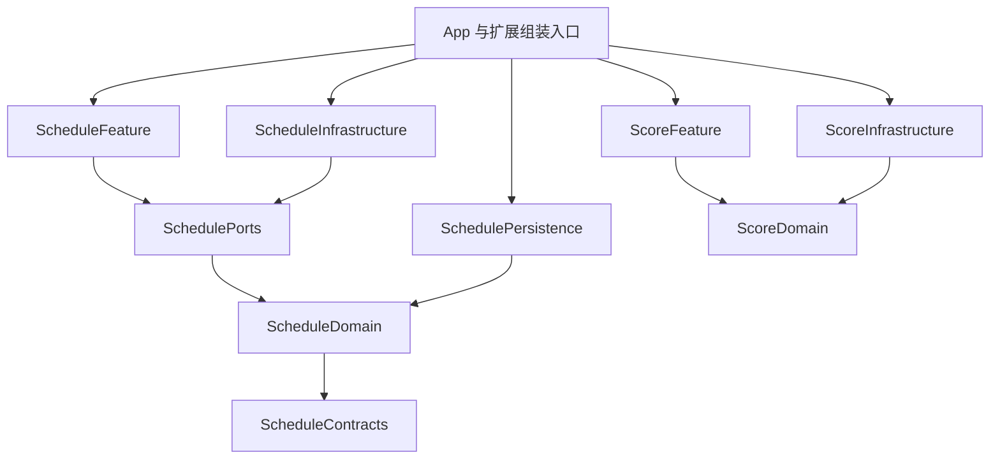

# 架构与数据边界

## 模块职责

`Package.swift` 定义本地模块及直接依赖，是编译边界的维护入口。模块源码位于 `Modules/<模块>/Sources/`。

| 模块 | 职责 |
| --- | --- |
| `StorageCore` | 文件服务、账号分区和 Codable 存储 |
| `TransportCore` | HTTP 传输、重定向、请求观察与取消语义 |
| `CommunityTransport` | 社区请求、账号代际、凭据快照、恢复合并与业务错误映射 |
| `ClientCore` | 学校认证协议、CAS 解析、会话状态与密码学适配契约 |
| `ScheduleContracts` | 外部快照、Watch 传输、时间线与展示状态契约 |
| `ScheduleSharedStore` | App Group 快照文件读写与迁移 |
| `ScheduleDomain` | 日程模型、场景快照、同步载荷和纯业务规则 |
| `SchedulePorts` | 学校服务协议、同步错误与平台操作协议 |
| `SchedulePersistence` | 注入式日程文件仓库、迁移、保护写入与版本校验 |
| `ScheduleInfrastructure` | 学校课表、DDL、空教室与认证服务实现 |
| `ScheduleFeature` | 日程仓库、场景状态、编辑、分享与页面 |
| `CommunityCore` | 社区模型与通用列表状态 |
| `CommunityUI` | 公共社区展示和跨场景目标工厂 |
| `DesignSystemKit`、`MediaKit` | 公共视觉组件、图片展示与缓存 |
| `ScoreDomain` | 成绩行、课程摘要、成绩服务协议与错误契约 |
| `ScoreInfrastructure` | 注入凭据、端点与传输的成绩和可信成绩单服务 |
| `ScoreFeature`、`MapFeature` | 成绩与校园地图场景 |
| `GalleryFeature`、`CourseFeature`、`PaperFeature`、`MineFeature` | 话廊、课程、文章与个人主页场景 |

依赖按基础能力、领域协议、业务场景、App 组装的职责组织。Feature 间导航通过 App 壳层提供的目标工厂连接。共享能力归所属模块，各模块声明实际使用的直接依赖。



图中展示主要业务依赖；网络、存储、学校认证和设计系统的直接依赖以 `Package.swift` 为准。重构证据、指标及后续边界见 [模块化审计](MODULARITY_AUDIT.md)。

## App 组装与状态流

App 入口位于 `BIT101-iOS/BIT101_iOSApp.swift`。`Login/` 承接凭据恢复和登录；`Shell/` 组装网络、账号仓库、业务依赖和全局路由；`Settings/` 承接设备偏好与用户操作。

```text
App 入口 → 登录恢复 → AppAccountLifecycle → 各场景状态与页面
                    ↘ 网络、存储、云同步、系统能力适配
```

- `AppAccountLifecycle` 接收 `ExperimentalPreferenceCloudSync`，从同一同步实例取得设置、账号仓库和账号来源；注入 `AppExternalDisplayCoordinating` 协调切号与外部展示。
- `AppPreferenceCacheEffects.configure(sync:)` 把保存回调绑定到该实例持有的设置、成绩、筛选和消息仓库；根视图传递同一组环境对象。
- `AppSettingsStore` 注入偏好存储与账号会话提供器。`AppAccountStores` 持有业务仓库及会话提供器，生产默认实例在 App 组装入口选择。
- ViewModel 通过场景化服务协议接收业务能力；View 绑定状态和操作，平台适配器负责系统副作用。
- `CommunityDestinations` 提供页面工厂，跨场景切换使用类型化绑定和回调。个人主页的删帖操作通过 `MineDependencies` 注入，业务动作归所属场景。
- 社区页面入口持有构造参数中的依赖，并向内部视图安装同一实例。课程评价入口直接接收 `CourseDependencies`，课程学分来源通过闭包注入。
- `ScheduleRepository` 持有完整日程缓存与写权限，课表、DDL、空教室通过场景快照提交所属字段。保存任务按实例排队，捕获账号、代际与修订；同步操作等待持久化完成，再发布成功状态。保存失败保留编辑并呈现错误。
- 保存期间的缓存通知在队列完成后重载，重载按本机修订核对归属；继续编辑的字段保留在仓库中。
- `AppScheduleCacheEffects` 连接保存后的云同步；Widget、Watch 与 Live Activity 由应用生命周期的平台适配器协调。系统日历导入消费课程快照和学期，事件展开及写入归平台适配器。

视觉令牌、公共组件和页面约束见 [设计系统](DESIGN_SYSTEM.md)。

## 网络边界

`HTTPClient` 负责 HTTP 响应和状态码；`CommunityAPIClient` 负责社区请求与业务映射；各 Service 描述 endpoint 和场景数据组合。传输通过 `HTTPTransport` 注入，请求准入与结果记录通过 `HTTPClientObserving` 注入。

`Shell/AppNetworkClients.swift` 组装连接池、网络提示、教学中心会话与诊断。`Login/CommunitySessionSupport.swift` 提供身份快照和按会话实例合并的登录恢复动作；用户主动诊断归 `Shell/NetworkDiagnosisRunner.swift`。`ScoreInfrastructure` 的生产端点和连接池在 App 扩展构造器中选择。

| 会话 | 边界 |
| --- | --- |
| `community` | 社区场景共用 Cookie、URLCache 与连接池 |
| `scoreAuthentication` | 普通成绩与可信成绩单共用 bit-login 传输，各自维护业务 challenge |
| `sensitiveDownloads` | ephemeral 配置下载可信成绩单图片，图片由页面 ViewModel 在内存持有 |
| 学校 CAS | 按业务需要分开管理手动重定向与 HTTPS 升级重定向会话 |
| 教学中心 | 使用独立 HTTPS delegate 和可失效的认证状态 |

- 学校会话的 Cookie 容器与传输实现配套注入。普通成绩使用 `jwb` challenge，可信成绩单使用 `jwb_cjd` challenge。
- 社区认证失败按 `CommunityRetryPolicy` 进入一次会话恢复重试；明确的凭据拒绝进入退出状态。请求发送、恢复、重放和解码完成时核对账号及登录代际，切号产生取消结果。学校认证与有副作用的请求按业务条件处理重试。
- 取消、超时、证书错误和业务失败保持各自语义。HTTP 状态和错误正文由共享传输层校验。
- JSON 解码使用可取消的并发任务，跨隔离域模型满足 `Sendable`；文件保存由串行队列或 actor 承接。
- 日志记录必要状态与错误分类，凭据、课表正文和学生信息保持在业务数据边界内。

## 存储与账号隔离

`AppStorageSession` 统一生成账号级偏好键和安全目录名，访客使用固定分区。任务创建时捕获账号归属；切号后根据代际处理迟到结果。

| 数据 | 保存位置与生命周期 |
| --- | --- |
| 学号、密码、`fake-cookie` | Keychain；安装标记位于 UserDefaults |
| 学校 Cookie | 对应会话的 Cookie 容器 |
| challenge、access token、短信状态 | 业务会话内存；退出、切号、过期或明确失效时清除 |
| 主题、旋转等设备偏好 | 应用级 UserDefaults |
| 账号设置、成绩筛选、消息已读状态 | 账号级偏好或业务仓库 |
| 日程、成绩、发帖草稿 | 账号隔离的 Application Support 文件 |
| 可重建图片与头像 | Caches，按容量和 LRU 策略回收 |
| 外部课表展示 | App Group 中的精简快照 |

- 文件保存采用原子替换及首次解锁后的数据保护。草稿图片以独立 JPEG 文件保存，单张上限 1 MiB。
- `SchedulePersistenceStore` 注入文件服务、根目录和用户状态比较器；App 的缓存适配器维护生产账号选择与通知，云同步基线在串行写入中合并。
- 日程缓存保存学校原始课程、手动调整规则和展示结果。分享导入追加 `sharedSchedules` 中的只读记录，导入字段为学期、首周、时间表与课程，当前账号日程保持原值。
- 日程和成绩缓存读取失败时保留源文件，暂停对应写入和同步，呈现恢复状态；扩展使用当前账号的空快照。
- 正常覆盖升级保留本地缓存、分享课表和偏好。新增 Codable 字段提供默认值，字段语义或类型变化维护迁移路径。
- 退出登录清理会话凭据，账号缓存和草稿保留供下次登录恢复。设置中的“删除所有文稿与数据”清理本地持久数据及 App Group 内容，远端 iCloud 数据继续保留。
- 重装后的首次启动依据安装标记清理旧 Keychain 凭据。登录恢复暂时受阻时保留待确认会话，远端明确返回凭据失效时清理登录凭据。

## iCloud 同步

两条同步链路分别维护开关、数据范围和冲突处理：

- **课表 CloudKit**：`ScheduleCloudSyncManager` 使用私有数据库，按账号同步手动调课、放假规则、个人日程、分享课表、手动 DDL、乐学 DDL 完成状态和日程偏好。学校课程、考试、DDL 正文和查询缓存保存在本机。
- **实验性偏好 KVS**：`ExperimentalPreferenceCloudSync` 同步设置、成绩筛选、成绩缓存与消息已读状态。开关保存在当前设备并按账号隔离，默认关闭；各域分别记录修改时间。成绩快照使用 LZFSE 压缩并检查配额。

CloudKit 使用带版本的精简载荷，本地记录保留服务器基线和待上传状态；本机编辑与远端分歧时提供版本选择。历史载荷通过已有迁移入口合并，版本兼容性决定同步准入。损坏的成绩缓存暂停该域的 KVS 同步。

## Widget、Watch 与 Live Activity

主 App 持有完整日程，导出 `ScheduleExternalSnapshot` 供外部展示消费：

```text
日程仓库 → 快照导出 → App Group → Widget / Live Activity
                   ↘ WatchConnectivity → Watch 本地镜像 → Watch App / Smart Stack
```

- App Group：`group.BIT101-dev.BIT101-iOS.shared`；快照路径：`Widgets/schedule-widget-snapshot.json`。
- 快照使用稳定的账号摘要表达归属；账号切换后的导出按 generation 串行协调。
- `ScheduleContracts` 提供共享编码、状态解析和时间线规划；`ScheduleSharedStore` 注入文件服务、容器地址和通知中心。App、Widget、Watch App 与 Watch Widget 在各自入口选择 App Group 容器，并显式传入快照解析器。
- `ScheduleExternalContentState` 区分同步、登录、快照有效性与课程状态；`ScheduleTimelineRefreshPlanner` 规划课程切换和跨日刷新。
- Watch 负责请求、落地和展示镜像；Live Activity 单独管理提醒生命周期。模型调整同步关注 App、iOS Widget、Watch App 和 Watch Widget。

分享链接与自定义 Scheme 的契约见 [Cloudflare 资源](../Cloudflare/README.md)。构建、测试和固定 fixture 的维护入口见 [构建与测试](TESTING.md)。
