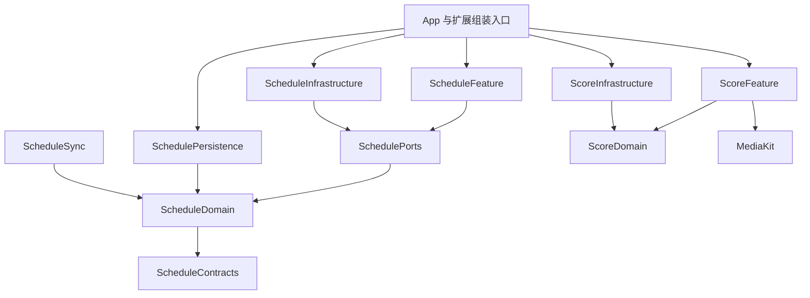

# 架构与数据边界

## 模块职责

`Package.swift` 定义本地模块及直接依赖，是编译边界的维护入口。模块源码位于 `Modules/<模块>/Sources/`。

| 模块 | 职责 |
| --- | --- |
| `StorageCore` | 文件服务、文件元数据与路径解析、账号分区和 Codable 存储 |
| `TransportCore` | HTTP 传输、会话构造、重定向、网络状态、网络缓存维护、请求观察与取消语义 |
| `CommunityTransport` | 社区请求、账号代际、凭据快照、恢复合并与业务错误映射 |
| `ClientCore` | 学校认证协议、CAS 解析、会话状态与密码学适配契约 |
| `ScheduleContracts` | 外部快照、Watch 传输、时间线与展示状态契约 |
| `ScheduleSharedStore` | App Group 快照文件读写与迁移 |
| `ScheduleDomain` | 日程模型、场景快照、同步载荷和纯业务规则 |
| `SchedulePorts` | 学校服务协议、同步错误与平台操作协议 |
| `SchedulePersistence` | 注入式日程文件仓库、迁移、保护写入与版本校验 |
| `ScheduleInfrastructure` | 学校课表、DDL、空教室与认证服务实现 |
| `ScheduleFeature` | 日程仓库、场景状态、编辑、分享与页面 |
| `CommunityCore` | 社区模型与通用列表状态 |
| `CommunityPersistence` | 注入式共享草稿与消息已读持久化、迁移和账号变更流 |
| `CommunityUI` | 公共社区展示、跨场景目标工厂和图片编辑组件 |
| `DesignSystemKit`、`MediaKit` | 公共视觉组件、图片展示与缓存 |
| `ScoreDomain` | 成绩行、课程摘要、刷新 / 排序 / 汇总规则及服务与存储端口 |
| `ScoreInfrastructure` | 注入式成绩 / 可信成绩单服务、成绩缓存与账号筛选存储 |
| `ScoreFeature`、`MapFeature` | 成绩与校园地图场景 |
| `GalleryFeature`、`CourseFeature`、`PaperFeature`、`MineFeature` | 话廊、课程、文章与个人主页场景 |

依赖按基础能力、领域协议、业务场景、App 组装的职责组织。Feature 间导航通过 App 壳层提供的目标工厂连接。共享能力归所属模块，各模块声明实际使用的直接依赖。



图中展示主要业务依赖；网络、存储、学校认证和设计系统的直接依赖以 `Package.swift` 为准。验证流程见 [构建与测试](TESTING.md)。

## App 组装与状态流

App 入口位于 `BIT101-iOS/BIT101_iOSApp.swift`。`Login/` 承接凭据恢复和登录；`Shell/` 组装网络、账号仓库、业务依赖和全局路由；`Settings/` 承接设备偏好与用户操作。

```text
App 入口 → 登录恢复 → AppAccountLifecycle → 各场景状态与页面
                    ↘ 网络、存储、云同步、系统能力适配
```

- 外部展示适配器显式接收账号会话、登录判断、Watch 激活、Widget 导出、后台刷新和 Live Activity 操作；生产能力由 App 入口组装，异步恢复后核对账号及取消归属。
- `ScheduleCourseSyncCoordinator` 持有课程同步、学期加载、短信等待和提交阶段，统一管理请求任务及账号重置取消。ViewModel 消费其展示状态，学期选择、课程编辑与持久化由日程场景承接。
- `AppAccountLifecycle` 显式接收日程实例、偏好同步、社区依赖、成绩服务、日程变更与课程加载能力、媒体、清理操作及外部展示协调器；设置与账号仓库由 App 入口显式提供，生命周期和偏好同步消费同一实例。生产日程、凭据后端、账号事件源和外部展示实例由 App 入口选择。
- `AppAccountSession` 选择凭据后端、学校 Cookie 清理能力和账号分区。`LoginStorage` 发布携带账号及代际的 typed 变更流；生命周期与社区请求消费同一凭据来源，事件归属在消费边界核对。Keychain 实现归 `KeychainLoginCredentials`，测试使用内存后端。
- 设置、成绩、筛选和消息仓库通过 typed 保存 publisher 发布账号会话；偏好同步协调器在构造时持有独立订阅。
- `AppSettingsStore` 注入偏好存储与账号会话提供器。`AppAccountStores` 持有业务仓库及会话提供器，生产默认实例在 App 组装入口选择。
- ViewModel 通过场景化服务协议接收业务能力；View 绑定状态和操作，平台适配器负责系统副作用。
- Profile、Poster、Paper、Settings 导航能力按消费者拆分，`AppCommunityDestinations` 负责跨 Feature 工厂。个人主页删帖通过 `MineDependencies` 注入，业务动作归所属场景。
- 页面入口显式接收状态、服务、MediaEnvironment 和所消费的导航能力，并向内部视图安装同一实例。导航目的地携带构造依赖，课程学分来源通过闭包注入。
- `ScheduleRepository` 持有完整日程缓存与写权限，课程、DDL、教室、展示偏好和同步元数据各自拥有独立状态；场景整体提交所属状态，跨场景查询消费只读上下文。保存任务按实例排队，捕获账号、代际与修订；同步操作等待持久化完成，再发布成功状态。保存失败保留编辑并呈现错误。
- 日程变更流按来源、账号和代际筛选；保存期间的重载在队列完成后按本机修订核对归属。继续编辑的字段保留在仓库中。
- `AppScheduleCacheEffects` 连接保存后的云同步；Widget、Watch 与 Live Activity 由应用生命周期的平台适配器协调。系统日历导入消费课程快照和学期，事件展开及写入归平台适配器。

- `ScheduleSync` 通过账号代际、按会话加载、比较保存、传输和冲突呈现协调用户状态；CloudKit 容器及 system fields 适配归 App。提醒上下文同样注入账号与缓存。
- 日程云同步保存已确认用户状态作为本机三方合并基线。独立 DDL、自定义日程、分享课表和手动课程规则按稳定 ID 合并，学校日程完成状态按 ID 合并；相对基线的删除继续传播，同一记录的并发分歧进入冲突选择。同步协调器通过单一阶段维护推送与拉取的互斥关系。
- 媒体校验和静态 / GIF 解码消费注入字节；Quick Look 通过显式系统文件服务准备 URL。ActivityKit 属性归 ScheduleActivityContracts，领域复用的 ScheduleContracts 提供纯共享快照及时间线。
- `MediaKit` 的预览协调器持有 Quick Look 控制器；来源视图拆除时取消资源准备并关闭预览，关闭回调按控制器身份匹配当前请求。

- 社区根页及详情页通过依赖、媒体和资源身份绑定内部场景生命周期，依赖替换会重建状态与任务。
- 推荐分页的共享请求携带独立身份；失败清理核对请求归属，刷新后的页面复用当前代际的缓存。
- `ScoreInfrastructure` 的服务、缓存和筛选存储分别由 `ScoreService`、`ScoreCacheStore` 和 `ScoreFilterPreferenceStore` 维护。`ScoreFeature` 消费 `ScoreCaching` 与 `ScoreFilterPreferencesStoring` 及各实例的 typed 账号变更流；缓存和筛选实现归 `ScoreInfrastructure`，刷新判断、排序与汇总归 `ScoreDomain`。本地保存流供偏好同步订阅，页面变更流按账号筛选。
- 可信成绩单页面通过 `MediaKit` 呈现本页图片预览，预览状态和挂载点随成绩单页面生命周期管理。
- 发帖编辑、校验、草稿恢复、上传重试和提交归 `GalleryComposerViewModel`；View 承接输入、确认和导航。页面拆除时取消在途操作，迟到结果核对账号代际与场景代际；编辑已有帖子沿所属帖子提交，新帖草稿保持独立归属。
- 共享草稿模型、图片限制和按消费者划分的存储端口归 `CommunityCore`；原子存储与迁移归 `CommunityPersistence`，图片编辑与压缩组件归 `CommunityUI`。存储注入图片准备闭包，Foundation 路径在包级宿主运行。图片尺寸限制由存储边界校验，账号路径、元数据和资产版本保持统一契约。
- 话廊消费 `GalleryComposerDraftStoring` 与 `GalleryMessageReadStoring`，建议提交页消费 `DeveloperSuggestionDraftStoring`。消息页面订阅所选存储实例的 typed 变更流，本地保存流供偏好同步订阅。
- 设置入口安装所选设置、日程及媒体实例；账号服务和凭据通过同一社区会话传递。清理服务接收文件后端和完整操作能力，生产 Keychain、偏好域、URLCache 与 WebKit 绑定归 App 工厂。
- `ScheduleCacheTimestamp` 的单调版本和云端恢复规则归领域层；App 保存队列通过公共协调器验证排队后的账号代际及取消状态。日程磁盘日期采用 Foundation 默认的完整精度编码，解码支持既有 ISO 8601 日期文本，比较保存沿精确版本执行。

视觉令牌、公共组件和页面约束见 [设计系统](DESIGN_SYSTEM.md)。

偏好同步采用版本化云端记录，读取既有记录后迁移到当前记录空间。读取结果区分缺值与格式错误，版本超前和损坏记录保持原值并显示同步问题。设置与筛选按字段版本合并，扩展字段随载荷往返保留；消息已读记录取并集，成绩沿快照版本同步。成绩刷新阶段明确区分认证、等待验证、简略查询、详细查询和空闲；短信等待的提交与取消清理携带所属请求身份。

## 网络边界

`HTTPClient` 负责 HTTP 响应和状态码；`CommunityAPIClient` 负责社区请求与业务映射；各 Service 描述 endpoint 和场景数据组合。带特殊字符的业务标识通过 `pathComponent` 作为单个路径段编码，资源路径与业务标识分别组装。传输通过 `HTTPTransport` 注入，请求准入与结果记录通过 `HTTPClientObserving` 注入。

`Shell/AppNetworkClients.swift` 组装连接池、网络提示、教学中心会话与诊断。`Login/CommunitySessionSupport.swift` 提供身份快照和按会话实例合并的登录恢复动作；用户主动诊断归 `Shell/NetworkDiagnosisRunner.swift`。`ScoreInfrastructure` 的生产端点和连接池在 App 扩展构造器中选择。

`URLSessionTransport` 在 TransportCore 内构造 Foundation 会话并维护共享网络缓存；App 的连接池选择配置、Cookie 容器、重定向策略及连接等待和超时参数，向业务层提供 `HTTPTransport`。登录客户端接收两种重定向策略的 `HTTPClient`；学校日程服务显式接收传输，生产与测试沿同一注入入口执行。

`NetworkPathState` 在 TransportCore 内维护可观察的连接快照。App 将同一实例注入话廊、文章及诊断展示，页面依据连接恢复执行所属场景的重试。测试宿主可注入固定快照，路径状态按实例隔离。

`HTTPFormEncoding` 统一学校 CAS、教学中心与乐学请求的表单字段编码，维护特殊字符、Unicode、字段顺序和重复字段语义。`ErrorChain` 统一取消、学校网络错误、日程提示与地图定位的底层错误遍历，按错误对象身份处理循环引用；各业务层维护所属错误分类。

`ScheduleServiceFactory` 为教学中心传输注入同一请求观察器，诊断在网络错误映射前记录原始原因。统一认证轮询的 `status: failed` 响应按业务失败记录；HTTP 状态码与服务端原因同时保留，提交反馈时按所选模式脱敏。

| 会话 | 边界 |
| --- | --- |
| `community` | 社区场景共用 Cookie、URLCache 与连接池 |
| `scoreAuthentication` | 普通成绩与可信成绩单共用 bit-login 传输，各自维护业务 challenge |
| `sensitiveDownloads` | ephemeral 配置下载可信成绩单图片，图片由页面 ViewModel 在内存持有 |
| 学校 CAS | 按业务需要分开管理手动重定向与 HTTPS 升级重定向会话 |
| 教学中心 | 使用独立 HTTPS delegate 和可失效的认证状态 |

- 学校会话的 Cookie 容器与传输实现配套注入。普通成绩使用 `jwb` challenge，可信成绩单使用 `jwb_cjd` challenge。
- 社区认证失败按 `CommunityRetryPolicy` 进入一次会话恢复重试；明确的凭据拒绝进入退出状态。请求发送、恢复、重放和解码完成时核对账号及登录代际，切号产生取消结果。学校认证与有副作用的请求按业务条件处理重试。
- 取消、超时、证书错误和业务失败保持各自语义。请求在准入、传输和响应处理边界检查取消；错误正文通过 `@concurrent` 解析，响应观察器按请求记录一次结果。
- JSON 解码、成绩解析、日程响应映射和话廊去重使用 `@concurrent`，沿用调用任务的取消状态、优先级和任务局部值；跨隔离域模型满足 `Sendable`。考试与教室记录映射由对应响应类型承接，网络服务组织请求与认证流程；文件保存由串行队列或 actor 承接。
- 日志记录必要状态与错误分类，凭据、课表正文和学生信息保持在业务数据边界内。

课程中心 DDL 通过分页 `POST /api/my-courses` 获取全部课程，逐课读取 `GET /api/courses/{id}/activities`，并发上限为 4。会话过期后复用学校认证恢复、CAS 跳转和公共短信验证能力。作业以提交次数、迟交次数或批阅字段识别，截止时间优先采用 `end_time`，随后采用 `visible_end_at`；无时区时间按北京时间解析，带时区时间保留实际时刻。

课程中心与乐学事件分别使用 `eclass` 和 `lexue` 来源。来源完整读取后替换对应缓存；部分失败保留该来源数据并呈现部分更新提示。学校事件按稳定 ID 保留完成状态，手动事件独立保存；详情显示中文来源。列表按滞留天数筛选过期事件，空态说明筛选数量与当前窗口。

## 存储与账号隔离

`AppStorageSession` 统一生成账号级偏好键和安全目录名，访客使用固定分区。任务创建时捕获账号归属；切号后根据代际处理迟到结果。

设置快照、成绩筛选与消息已读状态共用 `AccountScopedCodableStore` 的编码、读写和账号键迁移。仓库显式接收已有游客键后缀；设置沿用 `__default__`，其余消费者沿用 `guest`。设置实例与静态读取共用游客映射，账号隔离前的共享快照迁移归设置业务层。

| 数据 | 保存位置与生命周期 |
| --- | --- |
| 学号、密码、`fake-cookie` | Keychain；安装标记位于 UserDefaults |
| 学校 Cookie | 对应会话的 Cookie 容器 |
| challenge、access token、短信状态 | 业务会话内存；退出、切号、过期或明确失效时清除 |
| 主题、旋转等设备偏好 | 应用级 UserDefaults |
| 账号设置、成绩筛选、消息已读状态 | 账号级偏好或业务仓库 |
| 日程、成绩、发帖草稿 | 账号隔离的 Application Support 文件 |
| 可重建图片与头像 | Caches，按容量和 LRU 策略回收 |
| 外部课表展示 | App Group 中的精简快照 |

- 文件保存采用原子替换及首次解锁后的数据保护。草稿图片以独立 JPEG 文件保存，单张上限 1 MiB。草稿读取结果区分缺失、完整快照、读取损坏和格式版本差异；保存与提交清理沿完整源数据核对写权限，恢复状态保留元数据及图片。当前账号路径优先于历史路径，支持的历史载荷在成功原子写入后迁移源文件；明确放弃草稿时清理所属源路径。
- 文件字节、目录、元数据和符号链接解析统一由 `AppFileService` 承接；媒体缓存的 LRU 路径归一化消费所选文件后端。App 更新检查、偏好云同步和系统日历从 `AppFileDirectories.defaults` 选择生产偏好，测试沿显式注入入口选择独立实例。
- `SchedulePersistenceStore` 注入文件服务、根目录和用户状态比较器；App 的缓存适配器维护生产账号选择与通知，云同步基线在串行写入中合并。
- 日程磁盘快照使用整体 `schemaVersion`，当前格式按业务区域编码；历史平面格式由集中迁移入口解码，版本校验与完整解码决定写入准入。各学期学校课程、考试和首周日期统一存入 `ScheduleCourseData.schedulesByTerm`，当前展示由所选学期、手动首周日期和调课规则派生。完整日程滚动保留两个学期，归档学期保留原始课程供成绩匹配。分享导入追加 `sharedSchedules` 中的只读记录，导入字段为学期、首周、时间表与课程，当前账号日程保持原值。
- 日程和成绩缓存读取失败时保留源文件，暂停对应写入和同步，呈现恢复状态；扩展使用当前账号的空快照。
- 正常覆盖升级保留本地缓存、分享课表和偏好。日程磁盘格式变化递增整体版本，并在集中入口维护迁移；迁移为新增字段提供默认值，格式校验失败保留完整源文件。其他 Codable 模型沿所属领域维护默认值及字段迁移。
- 退出登录清理会话凭据，账号缓存和草稿保留供下次登录恢复。设置中的“删除所有文稿与数据”清理本地持久数据及 App Group 内容，远端 iCloud 数据继续保留。
- 重装后的首次启动依据安装标记清理旧 Keychain 凭据。登录恢复暂时受阻时保留待确认会话，远端明确返回凭据失效时清理登录凭据。

## iCloud 同步

两条同步链路分别维护开关、数据范围和冲突处理：

- **课表 CloudKit**：`ScheduleCloudSyncManager` 使用私有数据库，按账号同步手动调课、放假规则、个人日程、分享课表、手动 DDL、学校 DDL 完成状态和日程偏好。学校课程、考试、DDL 正文和查询缓存保存在本机。
- **实验性偏好 KVS**：`ExperimentalPreferenceCloudSync` 同步设置、成绩筛选、成绩缓存与消息已读状态。开关保存在当前设备并按账号隔离，默认关闭；设置与成绩筛选按字段记录版本，独立字段的离线编辑在重连时合并；同字段按版本选择，同版本分歧按规范编码排序收敛。消息已读记录按分类取并集，候选列表由本机服务端响应维护。成绩缓存按域时间选择完整快照，并使用 LZFSE 压缩和配额检查。字段版本与本机载荷按账号持久保存；历史同步载荷按其域时间初始化字段版本。
- 偏好同步的待处理域和任务引用由当前批次维护；账号切换后的旧批次在恢复执行时核对取消状态。

CloudKit 使用带版本的精简载荷，本地记录保留服务器基线、已确认的用户状态和待上传状态；并发编辑相对基线进行三方合并。个人日程、手动 DDL、分享课表与调课规则按稳定 ID 合并，完成状态按事件 ID 合并，独立偏好按字段合并；校区与所属教学楼作为一组选择维护。同一记录的编辑分歧或删除与编辑冲突交给版本选择。历史载荷通过已有迁移入口合并，版本兼容性决定同步准入。损坏的成绩缓存暂停该域的 KVS 同步。课表同步状态由协调器按账号代际发布，设置页呈现同步中、待同步、成功、账号不可用、版本冲突与失败状态。

## Widget、Watch 与 Live Activity

`ScheduleReminderPlanner` 维护提醒候选、展示窗口和刷新边界的纯规则；`ScheduleReminderNotifications` 承接系统通知授权、排期与清理，Live Activity 管理器协调活动和任务生命周期。

主 App 持有完整日程，导出 `ScheduleExternalSnapshot` 供外部展示消费：

```text
日程仓库 → 快照导出 → App Group → Widget / Live Activity
                   ↘ WatchConnectivity → Watch 本地镜像 → Watch App / Smart Stack
```

- App Group：`group.BIT101-dev.BIT101-iOS.shared`；快照路径：`Widgets/schedule-widget-snapshot.json`。
- 快照使用稳定的账号摘要表达归属；账号切换后的导出按 generation 串行协调。
- `ScheduleContracts` 提供共享编码、状态解析和时间线规划；`ScheduleSharedStore` 注入文件服务、容器地址和通知中心。App、Widget、Watch App 与 Watch Widget 在各自入口选择 App Group 容器，并显式传入快照解析器。
- 日程日历统一使用 `ScheduleSharedDateCodec.calendar`；课表表头与日期调整文案使用 `ScheduleDateCodec.formatCompactDate`，Live Activity 时间使用共享时分格式。学期、缓存日期和系统日历展开沿同一公历及时区计算。
- `ScheduleExternalContentState` 区分同步、登录、快照有效性与课程状态；`ScheduleTimelineRefreshPlanner` 规划课程切换和跨日刷新。
- Watch 负责请求、落地和展示镜像；Live Activity 单独管理提醒生命周期。模型调整同步关注 App、iOS Widget、Watch App 和 Watch Widget。
- WatchConnectivity 的回复和错误回调显式使用 `@Sendable`，快照落地和业务完成回调转到 `MainActor`；Watch 状态模型的注入端口声明相同隔离契约。
- 课前提醒后台刷新的启动回调通过主队列交付；过期回调使用 `@Sendable` 闭包取消刷新任务。

分享链接与自定义 Scheme 的契约见 [Cloudflare 资源](../Cloudflare/README.md)。构建、测试和固定 fixture 的维护入口见 [构建与测试](TESTING.md)。

## 服务边界门禁

`Scripts/check-module-boundaries.py` 从 SwiftPM 评估后的清单读取 target、源码路径、直接依赖和导出产品；模块集合与 `Modules/` 源码目录核对，层级方向和系统资源例外由检查器维护。清单中的多行、计算与条件表达式沿 SwiftPM 执行语义解析。检查器扫描全部生产模块、App、Widget 和 Watch 源码，并按实现文件校验系统资源归属：文件操作归 `StorageCore/AppFileService.swift`，HTTP 发送归 `TransportCore/HTTPClient.swift`，会话及网络缓存维护归 `TransportCore/SecureURLTransport.swift`，系统网络监听归 `TransportCore/NetworkPathState.swift`。偏好默认实例归 App 存储组装入口。UI 场景控制连接限定在 App 的测试启动代码，通过条件编译启用。

门禁覆盖传输实例引用、直接请求发送、文件字节读写、文件句柄、图像与流的文件入口、元数据及符号链接访问。检查器保留字符串插值中的可执行代码，自测覆盖合法模块调用及各类绕过调用。测试源码通过内存后端或系统资源准备 fixture，生产调用链遵循所属服务入口。公共能力新增时同步维护所属模块、注入路径和门禁规则。

表单编码、底层错误遍历与日程页面日期格式同样接受门禁校验，消费者通过所属公共入口扩展规则。
